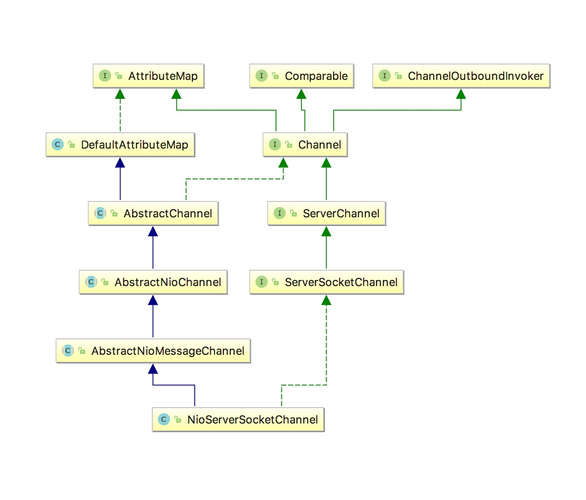
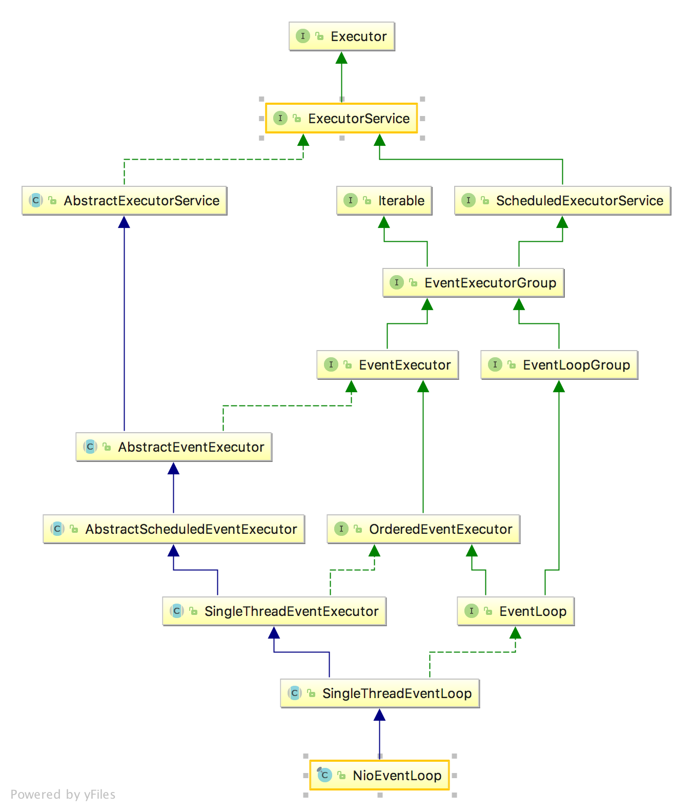

Channel这一块不像Bootstrap那么简介明了
这里包含了Channel，ChannelPipeLine，Future，Promise，Context这些东西。同时还包含了Util包的一些东西。
非常的复杂。
为了简化，我主要看NioServerSocketChannel和NioSocketChannel。

  
  
作为对比它的继承模式，再增加一个EpollServerSocketChannel的图


# 整体架构
netty进行了几个抽象。

## EventLoop
EventLoop其实是对一个线程的封装，netty把连接的channel给eventLoop
然后每个eventLoop可以同时操作很多的channel，每个channel从生到死都在一个eventLoop中，这就避免了多线程的锁操作。
提高了很多的效率。

# EventLoop

一般我们是直接生成NioEventLoopGroup，在NioEventLoopGroup中有一个工厂方法来得到NioEventLoop。
在MultithreadEventExecutorGroup类中定义了这个方法
```java
protected abstract EventExecutor newChild(Executor executor, Object... args) throws Exception;
```

在NioEventLoopGroup中的实现是这样
```java
@Override
protected EventLoop newChild(Executor executor, Object... args) throws Exception {
    return new NioEventLoop(this, executor, (SelectorProvider) args[0],
        ((SelectStrategyFactory) args[1]).newSelectStrategy(), (RejectedExecutionHandler) args[2]);
}
```
这个方法中有五个参数
* EventLoop所属的Group
* Loop中的Executor
* SelectorProvider
* SelectStrategy
* RejectedExecutionHandler

# new方法到底发生了啥
在Bootstrap中，我们在设置channel时，传进去了一个class对象
于是，在里面生成了一个ChannelFactory的工厂对象。
```java
public class ReflectiveChannelFactory<T extends Channel> implements ChannelFactory<T> {
  
    private final Class<? extends T> clazz;
  
    public ReflectiveChannelFactory(Class<? extends T> clazz) {
        if (clazz == null) {
            throw new NullPointerException("clazz");
        }
        this.clazz = clazz;
    }
  
    @Override
    public T newChannel() {
        try {
            return clazz.getConstructor().newInstance();
        } catch (Throwable t) {
            throw new ChannelException("Unable to create Channel from class " + clazz, t);
        }
    }

}
```
我们调用newChannel的时候其实是得到了一个默认的构造方法直接newInstance了。
在NioServerSocketChannel中
```java
private static final SelectorProvider DEFAULT_SELECTOR_PROVIDER = SelectorProvider.provider();
public NioServerSocketChannel() {
    this(newSocket(DEFAULT_SELECTOR_PROVIDER));
}

private static ServerSocketChannel newSocket(SelectorProvider provider) {
    try {
        return provider.openServerSocketChannel();
    } catch (IOException e) {
        throw new ChannelException(
                "Failed to open a server socket.", e);
    }
}

public NioServerSocketChannel(ServerSocketChannel channel) {
    super(null, channel, SelectionKey.OP_ACCEPT);
    config = new NioServerSocketChannelConfig(this, javaChannel().socket());
}
```

AbstractNioMessageChannel中
```java
protected AbstractNioMessageChannel(Channel parent, SelectableChannel ch, int readInterestOp) {
    super(parent, ch, readInterestOp);
}
```
AbstractNioChannel中
```java
protected AbstractNioChannel(Channel parent, SelectableChannel ch, int readInterestOp) {
    super(parent);
    this.ch = ch;
    this.readInterestOp = readInterestOp;
    try {
        ch.configureBlocking(false);
    } catch (IOException e) {
        try {
            ch.close();
        } catch (IOException e2) {
            if (logger.isWarnEnabled()) {
                logger.warn(
                        "Failed to close a partially initialized socket.", e2);
            }
        }

        throw new ChannelException("Failed to enter non-blocking mode.", e);
    }
}
```
AbstractChannel中
```java
protected AbstractChannel(Channel parent) {
    this.parent = parent;
    id = newId();
    unsafe = newUnsafe();
    pipeline = newChannelPipeline();
}
```

所以，整个流程是这样的
* ChannelFactory调用newChannel，调用的是ServerSocketChannel的默认构造方法
* ServerSocketChannel调用newSocket，创建一个新的ServerSocketChannel。
* AbstractChannel设置parent channel，给channel创建一个唯一的id，一个pipeline和一个unsafe实例
通过对比EpollServerSocketChannel的图，可以预见到到这一步是所有的channel通用的。  
下面才是NioServerSocketChannel特有的  
* AbstractNioChannel设置SelectionKey，服务端的是ON_ACCEPT，同时设置channel为非阻塞。
* ServerSocketChannel新建一个NioServerSocketChannelConfig，同时把SelectionKey.OP_ACCEPT传给父构造器


