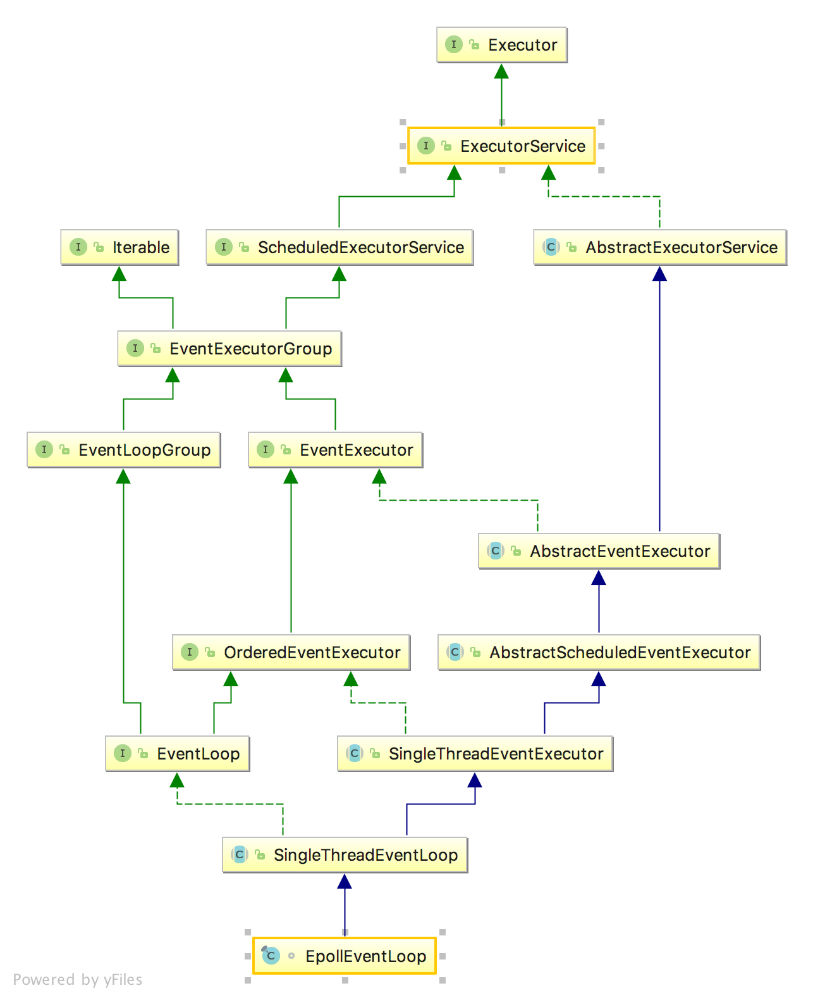

# 前言

所以我们还是从NioEventLoop入手

增加一个EpollEventLoop的对比  
  
可以看到，除了最后一个不同，其他的继承方法几乎都是一样的。

我感觉这是个模板方法

# Executor
可以看到继承链的最顶端是Executor接口  
这个接口可以说是核心接口了。  
Doug Lea大师的Executors框架的顶端也是这个接口
这个是Doug Lea的进行一个抽象。
```java
public interface Executor {
    void execute(Runnable command);
}
```
它只有一个方法，就是execute方法。
Doug Lea大师的解释很精彩，我抄过来
```java
/**
 * An object that executes submitted {@link Runnable} tasks. This
 * interface provides a way of decoupling task submission from the
 * mechanics of how each task will be run, including details of thread
 * use, scheduling, etc.  An {@code Executor} is normally used
 * instead of explicitly creating threads. For example, rather than
 * invoking {@code new Thread(new(RunnableTask())).start()} for each
 * of a set of tasks, you might use:
 *
 * <pre>
 * Executor executor = <em>anExecutor</em>;
 * executor.execute(new RunnableTask1());
 * executor.execute(new RunnableTask2());
 * ...
 * </pre>
 *
 * However, the {@code Executor} interface does not strictly
 * require that execution be asynchronous. In the simplest case, an
 * executor can run the submitted task immediately in the caller's
 * thread:
 *
 *  <pre> {@code
 * class DirectExecutor implements Executor {
 *   public void execute(Runnable r) {
 *     r.run();
 *   }
 * }}</pre>
 *
 * More typically, tasks are executed in some thread other
 * than the caller's thread.  The executor below spawns a new thread
 * for each task.
 *
 *  <pre> {@code
 * class ThreadPerTaskExecutor implements Executor {
 *   public void execute(Runnable r) {
 *     new Thread(r).start();
 *   }
 * }}</pre>
 *
 * Many {@code Executor} implementations impose some sort of
 * limitation on how and when tasks are scheduled.  The executor below
 * serializes the submission of tasks to a second executor,
 * illustrating a composite executor.
 *
 *  <pre> {@code
 * class SerialExecutor implements Executor {
 *   final Queue<Runnable> tasks = new ArrayDeque<Runnable>();
 *   final Executor executor;
 *   Runnable active;
 *
 *   SerialExecutor(Executor executor) {
 *     this.executor = executor;
 *   }
 *
 *   public synchronized void execute(final Runnable r) {
 *     tasks.offer(new Runnable() {
 *       public void run() {
 *         try {
 *           r.run();
 *         } finally {
 *           scheduleNext();
 *         }
 *       }
 *     });
 *     if (active == null) {
 *       scheduleNext();
 *     }
 *   }
 *
 *   protected synchronized void scheduleNext() {
 *     if ((active = tasks.poll()) != null) {
 *       executor.execute(active);
 *     }
 *   }
 * }}</pre>
 *
 * The {@code Executor} implementations provided in this package
 * implement {@link ExecutorService}, which is a more extensive
 * interface.  The {@link ThreadPoolExecutor} class provides an
 * extensible thread pool implementation. The {@link Executors} class
 * provides convenient factory methods for these Executors.
 *
 * <p>Memory consistency effects: Actions in a thread prior to
 * submitting a {@code Runnable} object to an {@code Executor}
 * <a href="package-summary.html#MemoryVisibility"><i>happen-before</i></a>
 * its execution begins, perhaps in another thread.
 *
 * @since 1.5
 * @author Doug Lea
 */
 ```

# 初始化流程
在NioEventLoopGroup中的调用是这样的。
```java
@Override
protected EventLoop newChild(Executor executor, Object... args) throws Exception {
    return new NioEventLoop(this, executor, (SelectorProvider) args[0],
        ((SelectStrategyFactory) args[1]).newSelectStrategy(), (RejectedExecutionHandler) args[2]);
}
```
而在NioEventLoop中确实也只有这么一个构造函数，可以说是很简洁了。  
这五个参数
* EventLoop所在的EventLoopGroup
* Executor 
默认的是`ThreadPerTaskExecutor(ThreadFactory threadFactory)`  
其中的ThreadFactory参见FastThreadLocalThread。
```java
//从名字我们就可以看出其实就是一个任务就创建一个线程的Executor。
public final class ThreadPerTaskExecutor implements Executor {
    private final ThreadFactory threadFactory;

    public ThreadPerTaskExecutor(ThreadFactory threadFactory) {
        if (threadFactory == null) {
            throw new NullPointerException("threadFactory");
        }
        this.threadFactory = threadFactory;
    }

    @Override
    public void execute(Runnable command) {
        threadFactory.newThread(command).start();
    }
}
```
* SelectorProvider 就是SelectorProvider。。。直接调用SelectorProvider.provider()得到的。
* SelectStrategy  
默认的是SelectStrategy.INSTANCE 
参看DefaultSelectStrategy 
只有两个状态  continue和select
TODO
* RejectedExecutionHandler  默认是抛出异常 参见RejectedExecutionHandlers TODO


下面再详细的看看
```java
## NioEventLoop -> 
private final SelectorProvider provider;
NioEventLoop(NioEventLoopGroup parent, Executor executor, SelectorProvider selectorProvider,
             SelectStrategy strategy, RejectedExecutionHandler rejectedExecutionHandler) {
    //DEFAULT_MAX_PENDING_TASKS见下，默认是16，不过我们还可以进行设置
    //第三个参数是addTaskWakesUp，默认设为false，TODO
    super(parent, executor, false, DEFAULT_MAX_PENDING_TASKS, rejectedExecutionHandler);
    if (selectorProvider == null) {
        throw new NullPointerException("selectorProvider");
    }
    if (strategy == null) {
        throw new NullPointerException("selectStrategy");
    }
    provider = selectorProvider;
    //openSelector方法默认会进行Selector的set优化
    //参见io.netty.channel.nio.SelectedSelectionKeySet
    final SelectorTuple selectorTuple = openSelector();
    selector = selectorTuple.selector;
    unwrappedSelector = selectorTuple.unwrappedSelector;
    selectStrategy = strategy;
}
//这里看到有两个selector，一个是selector，一个是unwrappedSelector
//如果不进行优化，这两个是一样的
//如果进行了优化，那么第二个就是优化过的selector， 是netty重写的SelectedSelectionKeySetSelector
//但是底层的selector对象还是一样的。
//所以设为两个有什么意思我还是不明白 。。。。 TODO

private SelectorTuple openSelector() {
    final Selector unwrappedSelector;
    try {
        unwrappedSelector = provider.openSelector();
    } catch (IOException e) {
        throw new ChannelException("failed to open a new selector", e);
    }

    //如果不开启优化，那就直接返回了
    if (DISABLE_KEYSET_OPTIMIZATION) {
        return new SelectorTuple(unwrappedSelector);
    }

    //如果开启优化，那么就用SelectedSelectionKeySet代替Selector中的Set
    final SelectedSelectionKeySet selectedKeySet = new SelectedSelectionKeySet();

    Object maybeSelectorImplClass = AccessController.doPrivileged(new PrivilegedAction<Object>() {
        @Override
        public Object run() {
            try {
                return Class.forName(
                        "sun.nio.ch.SelectorImpl",
                        false,
                        PlatformDependent.getSystemClassLoader());
            } catch (Throwable cause) {
                return cause;
            }
        }
    });
    //...

    final Class<?> selectorImplClass = (Class<?>) maybeSelectorImplClass;

    Object maybeException = AccessController.doPrivileged(new PrivilegedAction<Object>() {
        @Override
        public Object run() {
            try {
                Field selectedKeysField = selectorImplClass.getDeclaredField("selectedKeys");
                Field publicSelectedKeysField = selectorImplClass.getDeclaredField("publicSelectedKeys");

                Throwable cause = ReflectionUtil.trySetAccessible(selectedKeysField);
                if (cause != null) {
                    return cause;
                }
                cause = ReflectionUtil.trySetAccessible(publicSelectedKeysField);
                if (cause != null) {
                    return cause;
                }
                //替换操作。
                selectedKeysField.set(unwrappedSelector, selectedKeySet);
                publicSelectedKeysField.set(unwrappedSelector, selectedKeySet);
                return null;
            } catch (NoSuchFieldException e) {
                return e;
            } catch (IllegalAccessException e) {
                return e;
            }
        }
    });
   //...
   selectedKeys = selectedKeySet;
        logger.trace("instrumented a special java.util.Set into: {}", unwrappedSelector);
        return new SelectorTuple(unwrappedSelector,
                                 new SelectedSelectionKeySetSelector(unwrappedSelector, selectedKeySet));
}
```

```java
## SingleThreadEventLoop ->
//这个tailTask和下面的taskQueue有什么区别呢，我也不知道
private final Queue<Runnable> tailTasks;
protected static final int DEFAULT_MAX_PENDING_TASKS = Math.max(16,
            SystemPropertyUtil.getInt("io.netty.eventLoop.maxPendingTasks", Integer.MAX_VALUE));
protected SingleThreadEventLoop(EventLoopGroup parent, ThreadFactory threadFactory,
                                boolean addTaskWakesUp, int maxPendingTasks,
                                RejectedExecutionHandler rejectedExecutionHandler) {
    super(parent, threadFactory, addTaskWakesUp, maxPendingTasks, rejectedExecutionHandler);
    tailTasks = newTaskQueue(maxPendingTasks);
}

## SingleThreadEventExecutor -> 
protected SingleThreadEventExecutor(
        EventExecutorGroup parent, ThreadFactory threadFactory,
        boolean addTaskWakesUp, int maxPendingTasks, RejectedExecutionHandler rejectedHandler) {
    this(parent, new ThreadPerTaskExecutor(threadFactory), addTaskWakesUp, maxPendingTasks, rejectedHandler);
}
private final boolean addTaskWakesUp;  
//最多在等待的Task数量，如果大于，那么就看RejectedExecutionHandler怎么说了。
//在SingleThreadEventExecutor中定义了这个方法
//protected final void reject(Runnable task) {
//    rejectedExecutionHandler.rejected(task, this);
//}
private final int maxPendingTasks;   
//executor，默认就是ThreadPerTaskExecutor
private final Executor executor;
//taskQueue使用的是LinkedBlockingQueue
private final Queue<Runnable> taskQueue;
private final RejectedExecutionHandler rejectedExecutionHandler;
protected SingleThreadEventExecutor(EventExecutorGroup parent, Executor executor,
                                    boolean addTaskWakesUp, int maxPendingTasks,
                                    RejectedExecutionHandler rejectedHandler) {
    super(parent);
    this.addTaskWakesUp = addTaskWakesUp;
    this.maxPendingTasks = Math.max(16, maxPendingTasks);
    this.executor = ObjectUtil.checkNotNull(executor, "executor");
    taskQueue = newTaskQueue(this.maxPendingTasks);
    rejectedExecutionHandler = ObjectUtil.checkNotNull(rejectedHandler, "rejectedHandler");
}
protected Queue<Runnable> newTaskQueue(int maxPendingTasks) {
    return new LinkedBlockingQueue<Runnable>(maxPendingTasks);
}

AbstractScheduledEventExecutor -> 
protected AbstractScheduledEventExecutor(EventExecutorGroup parent) {
    super(parent);
}


## AbstractEventExecutor -> 
private final EventExecutorGroup parent;
//EventExecutorGroup其实就是EventLoopGroup的父类抽象
protected AbstractEventExecutor(EventExecutorGroup parent) {
    this.parent = parent;
}
```


# 运行
其实我一直很好奇，channel是怎么注册到EventLoop中的。
从Bootstrap的分析我们可以知道，在ServerBootstrapAcceptor中的read0方法中，调用了
`childGroup.register(child)`
方法。
那么调用链是啥样的呢。
```java
## MultithreadEventLoopGroup -> 
public EventLoop next() {
    return (EventLoop) super.next();
}
public ChannelFuture register(Channel channel) {
    return next().register(channel);
}
//从这里我们可以看到是间接的调用了EventLoop的register的方法

## SingleThreadEventLoop -> 
public ChannelFuture register(Channel channel) {
    return register(new DefaultChannelPromise(channel, this));
}

public ChannelFuture register(final ChannelPromise promise) {
    ObjectUtil.checkNotNull(promise, "promise");
    promise.channel().unsafe().register(this, promise);
    return promise;
}
//这里提到了unsafe，见下
```

```java
## AbstractChannel -> 
@Override
public final void register(EventLoop eventLoop, final ChannelPromise promise) {
    if (eventLoop == null) {
        throw new NullPointerException("eventLoop");
    }
    if (isRegistered()) {
        promise.setFailure(new IllegalStateException("registered to an event loop already"));
        return;
    }
    if (!isCompatible(eventLoop)) {
        promise.setFailure(
                new IllegalStateException("incompatible event loop type: " + eventLoop.getClass().getName()));
        return;
    }

    AbstractChannel.this.eventLoop = eventLoop;

    if (eventLoop.inEventLoop()) {
        register0(promise);
    } else {
        try {
            eventLoop.execute(new Runnable() {
                @Override
                public void run() {
                    register0(promise);
                }
            });
        } catch (Throwable t) {
            logger.warn(
                    "Force-closing a channel whose registration task was not accepted by an event loop: {}",
                    AbstractChannel.this, t);
            closeForcibly();
            closeFuture.setClosed();
            safeSetFailure(promise, t);
        }
    }
}

## AbstractUnsafe -> 
private void register0(ChannelPromise promise) {
    try {
        // check if the channel is still open as it could be closed in the mean time when the register
        // call was outside of the eventLoop
        if (!promise.setUncancellable() || !ensureOpen(promise)) {
            return;
        }
        boolean firstRegistration = neverRegistered;
        doRegister();
        neverRegistered = false;
        registered = true;

        // Ensure we call handlerAdded(...) before we actually notify the promise. This is needed as the
        // user may already fire events through the pipeline in the ChannelFutureListener.
        pipeline.invokeHandlerAddedIfNeeded();

        safeSetSuccess(promise);
        pipeline.fireChannelRegistered();
        // Only fire a channelActive if the channel has never been registered. This prevents firing
        // multiple channel actives if the channel is deregistered and re-registered.
        if (isActive()) {
            if (firstRegistration) {
                pipeline.fireChannelActive();
            } else if (config().isAutoRead()) {
                // This channel was registered before and autoRead() is set. This means we need to begin read
                // again so that we process inbound data.
                //
                // See https://github.com/netty/netty/issues/4805
                beginRead();
            }
        }
    } catch (Throwable t) {
        // Close the channel directly to avoid FD leak.
        closeForcibly();
        closeFuture.setClosed();
        safeSetFailure(promise, t);
    }
}

## AbstractNioChannel ->
@Override
protected void doRegister() throws Exception {
    boolean selected = false;
    for (;;) {
        try {
            //这里的interested设为了0，就是对什么事都不敢兴趣
            //OP_ACCEPT = 1 << 4
            //OP_WRITE = 1 << 2
            //OP_CONNECT = 1 << 3
            //OP_ACCEPT = 1 << 4
            //同时注册到了unwrappedSelector上。。。嗯。。。。 TODO
            selectionKey = javaChannel().register(eventLoop().unwrappedSelector(), 0, this);
            return;
        } catch (CancelledKeyException e) {
            if (!selected) {
                // Force the Selector to select now as the "canceled" SelectionKey may still be
                // cached and not removed because no Select.select(..) operation was called yet.
                eventLoop().selectNow();
                selected = true;
            } else {
                // We forced a select operation on the selector before but the SelectionKey is still cached
                // for whatever reason. JDK bug ?
                throw e;
            }
        }
    }
}
```

# run
既然EventLoop中包含了一个线程，那么肯定是要run起来的。  
在ServerBootstrap中，我们在init方法中 
```java
@Override
void init(Channel channel) throws Exception {
    //...
    p.addLast(new ChannelInitializer<Channel>() {
        @Override
        public void initChannel(final Channel ch) throws Exception {
            //...
            ch.eventLoop().execute(new Runnable() {
                @Override
                public void run() {
                    pipeline.addLast(new ServerBootstrapAcceptor(
                            ch, currentChildGroup, currentChildHandler, currentChildOptions, currentChildAttrs));
                }
            });
        }
    });
}
```
在initChannel方法中，调用ch所在的eventLoop，执行了一个Runnable。
那么到EventLoop中就是
这里会调用startThread()方法，我们的EventLoop线程就是在这里开始的。
```java
## SingleThreadEventExecutor ->
@Override
public void execute(Runnable task) {
    if (task == null) {
        throw new NullPointerException("task");
    }
    boolean inEventLoop = inEventLoop();
    if (inEventLoop) {
        addTask(task);
    } else {
        startThread();
        addTask(task);
        if (isShutdown() && removeTask(task)) {
            reject();
        }
    }

    if (!addTaskWakesUp && wakesUpForTask(task)) {
        wakeup(inEventLoop);
    }
}
private void startThread() {
    if (state == ST_NOT_STARTED) {
        if (STATE_UPDATER.compareAndSet(this, ST_NOT_STARTED, ST_STARTED)) {
            doStartThread();
        }
    }
}
private void doStartThread() {
    assert thread == null;
    executor.execute(new Runnable() {
        @Override
        public void run() {
            thread = Thread.currentThread();
            if (interrupted) {
                thread.interrupt();
            }

            boolean success = false;
            updateLastExecutionTime();
            try {
                //核心在这里，这会调用到NioEventLoop中的run方法
                SingleThreadEventExecutor.this.run();
                success = true;
            } catch (Throwable t) {
                logger.warn("Unexpected exception from an event executor: ", t);
            } finally {
                for (;;) {
                    int oldState = state;
                    if (oldState >= ST_SHUTTING_DOWN || STATE_UPDATER.compareAndSet(
                            SingleThreadEventExecutor.this, oldState, ST_SHUTTING_DOWN)) {
                        break;
                    }
                }

                // Check if confirmShutdown() was called at the end of the loop.
                if (success && gracefulShutdownStartTime == 0) {
                    logger.error("Buggy " + EventExecutor.class.getSimpleName() + " implementation; " +
                            SingleThreadEventExecutor.class.getSimpleName() + ".confirmShutdown() must be called " +
                            "before run() implementation terminates.");
                }

                try {
                    // Run all remaining tasks and shutdown hooks.
                    for (;;) {
                        if (confirmShutdown()) {
                            break;
                        }
                    }
                } finally {
                    try {
                        cleanup();
                    } finally {
                        STATE_UPDATER.set(SingleThreadEventExecutor.this, ST_TERMINATED);
                        threadLock.release();
                        if (!taskQueue.isEmpty()) {
                            logger.warn(
                                    "An event executor terminated with " +
                                            "non-empty task queue (" + taskQueue.size() + ')');
                        }

                        terminationFuture.setSuccess(null);
                    }
                }
            }
        }
    });
}
```

下面我们就会NioEventLoop的run方法，也就是线程的run方法进行分析。
```java
## NioEventLoop ->
private final IntSupplier selectNowSupplier = new IntSupplier() {
    @Override
    public int get() throws Exception {
        return selectNow();
    }
};
/**
 * Boolean that controls determines if a blocked Selector.select should
 * break out of its selection process. In our case we use a timeout for
 * the select method and the select method will block for that time unless
 * waken up.
 */
private final AtomicBoolean wakenUp = new AtomicBoolean();
int selectNow() throws IOException {
    try {
        return selector.selectNow();
    } finally {
        // restore wakeup state if needed
        if (wakenUp.get()) {
            //这里的wakeup很奇怪，因为整个run都在一个线程中执行
            //为啥这里调用一个wakeup
            //后来查了资料才知道，及时在一个线程中，如果当前无select操作
            //调用了wakeup之后，下一个select操作将会立刻返回。
            selector.wakeup();
        }
    }
}
@Override
protected void run() {
    for (;;) {
        try {
            //public int calculateStrategy(IntSupplier selectSupplier, boolean hasTasks) throws Exception {
            //    return hasTasks ? selectSupplier.get() : SelectStrategy.SELECT;
            //}
            //规则就是调用非阻塞的selectNow,如果没有准备好的key，或者没有需要执行的用户task
            //这个hasTasks判断的是SingleThreadEventExecutor中的taskQueue和SingleThreadEventLoop中的tailTasks是否同时为空
            //如果两个都满足
            //那么就continue掉，重新try
            switch (selectStrategy.calculateStrategy(selectNowSupplier, hasTasks())) {
                case SelectStrategy.CONTINUE:
                    continue;
                //如果不是，那么就进行select操作。
                case SelectStrategy.SELECT:
                    select(wakenUp.getAndSet(false));

                    // 'wakenUp.compareAndSet(false, true)' is always evaluated
                    // before calling 'selector.wakeup()' to reduce the wake-up
                    // overhead. (Selector.wakeup() is an expensive operation.)
                    //
                    // However, there is a race condition in this approach.
                    // The race condition is triggered when 'wakenUp' is set to
                    // true too early.
                    //
                    // 'wakenUp' is set to true too early if:
                    // 1) Selector is waken up between 'wakenUp.set(false)' and
                    //    'selector.select(...)'. (BAD)
                    // 2) Selector is waken up between 'selector.select(...)' and
                    //    'if (wakenUp.get()) { ... }'. (OK)
                    //
                    // In the first case, 'wakenUp' is set to true and the
                    // following 'selector.select(...)' will wake up immediately.
                    // Until 'wakenUp' is set to false again in the next round,
                    // 'wakenUp.compareAndSet(false, true)' will fail, and therefore
                    // any attempt to wake up the Selector will fail, too, causing
                    // the following 'selector.select(...)' call to block
                    // unnecessarily.
                    //
                    // To fix this problem, we wake up the selector again if wakenUp
                    // is true immediately after selector.select(...).
                    // It is inefficient in that it wakes up the selector for both
                    // the first case (BAD - wake-up required) and the second case
                    // (OK - no wake-up required).

                    if (wakenUp.get()) {
                        selector.wakeup();
                    }
                    // fall through
                default:
            }

            cancelledKeys = 0;
            needsToSelectAgain = false;
            //这个ioRatio TODO
            final int ioRatio = this.ioRatio;
            if (ioRatio == 100) {
                try {
                    //处理所有的准备好的key
                    processSelectedKeys();
                } finally {
                    // Ensure we always run tasks.
                    //执行用户的task
                    runAllTasks();
                }
            } else {
                final long ioStartTime = System.nanoTime();
                try {
                    processSelectedKeys();
                } finally {
                    // Ensure we always run tasks.
                    final long ioTime = System.nanoTime() - ioStartTime;
                    runAllTasks(ioTime * (100 - ioRatio) / ioRatio);
                }
            }
        } catch (Throwable t) {
            handleLoopException(t);
        }
        // Always handle shutdown even if the loop processing threw an exception.
        try {
            if (isShuttingDown()) {
                closeAll();
                if (confirmShutdown()) {
                    return;
                }
            }
        } catch (Throwable t) {
            handleLoopException(t);
        }
    }
}
private void select(boolean oldWakenUp) throws IOException {
    Selector selector = this.selector;
    try {
        int selectCnt = 0;
        long currentTimeNanos = System.nanoTime();
        long selectDeadLineNanos = currentTimeNanos + delayNanos(currentTimeNanos);
        for (;;) {
            long timeoutMillis = (selectDeadLineNanos - currentTimeNanos + 500000L) / 1000000L;
            if (timeoutMillis <= 0) {
                if (selectCnt == 0) {
                    selector.selectNow();
                    selectCnt = 1;
                }
                break;
            }

            // If a task was submitted when wakenUp value was true, the task didn't get a chance to call
            // Selector#wakeup. So we need to check task queue again before executing select operation.
            // If we don't, the task might be pended until select operation was timed out.
            // It might be pended until idle timeout if IdleStateHandler existed in pipeline.
            if (hasTasks() && wakenUp.compareAndSet(false, true)) {
                selector.selectNow();
                selectCnt = 1;
                break;
            }

            int selectedKeys = selector.select(timeoutMillis);
            selectCnt ++;

            if (selectedKeys != 0 || oldWakenUp || wakenUp.get() || hasTasks() || hasScheduledTasks()) {
                // - Selected something,
                // - waken up by user, or
                // - the task queue has a pending task.
                // - a scheduled task is ready for processing
                break;
            }
            if (Thread.interrupted()) {
                // Thread was interrupted so reset selected keys and break so we not run into a busy loop.
                // As this is most likely a bug in the handler of the user or it's client library we will
                // also log it.
                //
                // See https://github.com/netty/netty/issues/2426
                if (logger.isDebugEnabled()) {
                    logger.debug("Selector.select() returned prematurely because " +
                            "Thread.currentThread().interrupt() was called. Use " +
                            "NioEventLoop.shutdownGracefully() to shutdown the NioEventLoop.");
                }
                selectCnt = 1;
                break;
            }

            long time = System.nanoTime();
            if (time - TimeUnit.MILLISECONDS.toNanos(timeoutMillis) >= currentTimeNanos) {
                // timeoutMillis elapsed without anything selected.
                selectCnt = 1;
            } else if (SELECTOR_AUTO_REBUILD_THRESHOLD > 0 &&
                    selectCnt >= SELECTOR_AUTO_REBUILD_THRESHOLD) {
                // The selector returned prematurely many times in a row.
                // Rebuild the selector to work around the problem.
                //这里处理jdk的bug问题。通过rebuildSelector来。
                logger.warn(
                        "Selector.select() returned prematurely {} times in a row; rebuilding Selector {}.",
                        selectCnt, selector);

                rebuildSelector();
                selector = this.selector;

                // Select again to populate selectedKeys.
                selector.selectNow();
                selectCnt = 1;
                break;
            }

            currentTimeNanos = time;
        }

        if (selectCnt > MIN_PREMATURE_SELECTOR_RETURNS) {
            if (logger.isDebugEnabled()) {
                logger.debug("Selector.select() returned prematurely {} times in a row for Selector {}.",
                        selectCnt - 1, selector);
            }
        }
    } catch (CancelledKeyException e) {
        if (logger.isDebugEnabled()) {
            logger.debug(CancelledKeyException.class.getSimpleName() + " raised by a Selector {} - JDK bug?",
                    selector, e);
        }
        // Harmless exception - log anyway
    }
}


private void processSelectedKeys() {
    if (selectedKeys != null) {
        processSelectedKeysOptimized();
    } else {
        processSelectedKeysPlain(selector.selectedKeys());
    }
}
```
